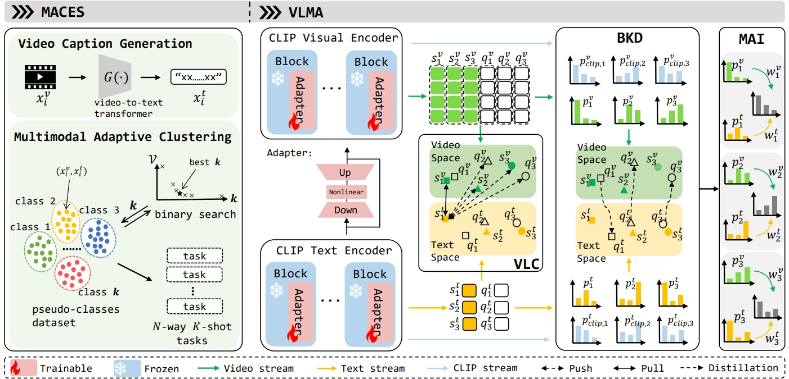

# MACES-VLMA

Jiaxin Chen, Jiawen Peng, Yanzuo Lu, Jian-Huang Lai, Andy J. Ma, “Vision-Language Adaptive Clustering and Meta-Adaptation for Unsupervised Few-Shot Action Recognition,” in TCSVT 2024, under review.

Unsupervised few-shot action recognition is a practical but challenging task, which adapts knowledge learned from unlabeled videos to novel action classes with only limited labeled data. 
Without annotated data of base action classes for meta-learning, it cannot achieve satisfactory performance due to poor pre-trained models.
Directly replacing pre-trained models with CLIP's visual encoder can only lead to limited performance improvements.
This is primarily attributed to the poor quality of the constructed pseudo-classes and episodes, coupled with the absence of textual modality information.
In this paper, we propose fully exploiting the multimodal knowledge of a pre-trained vision-language model such as CLIP in a novel framework for unsupervised video meta-learning. 
Textual modality is automatically generated for each unlabeled video by a video-to-text transformer. 
Multimodal adaptive clustering for episodic sampling (MACES) based on a video-text ensemble distance metric is proposed to accurately estimate pseudo-classes, which constructs high-quality few-shot tasks (episodes) for episodic training. 
Vision-language meta-adaptation (VLMA) is designed for adapting the pre-trained model to novel tasks by category-aware vision-language contrastive learning and confidence-based reliable bidirectional knowledge distillation. 
The final prediction is obtained by multimodal adaptive inference. 
Extensive experiments on five benchmarks demonstrate the superiority of our method for unsupervised few-shot action recognition. 



## Requirements

python3 and torch1.8

## Structure

- backbone: To save the trained models.
- config: The configuration file.
- method: The main files of the code, including the dataset and MECES-VLMA models.
- utils: 
- vcache:
- main.py: Program entrance.

## Dataset

### HMDB51

HMDB51 comprises 51 distinct human motion categories, encompassing various daily activities such as walking and running. 
HMDB51 has 31 action classes with 4,280 videos, 10 action classes with 1,194 videos, and 10 action classes with 1,292 videos for meta-training, meta-validation, and meta-testing, respectively.

### UCF101

UCF101 consists of 13,320 video clips, which are classified into 101 categories. 
We follow the splitting strategy proposed in ARN. 
UCF101 has 70 action classes with 9,154 videos, 10 action classes with 1,421 videos, and 21 action classes with 2,745 videos for meta-training, meta-validation, and meta-testing, respectively.

### Kinetics

Kinetics consists of 400 action classes and 306,245 video clips. 
Following the dataset split used by CMN for few-shot action recognition, we construct a dataset containing 100 action classes: 64 classes with 6,389 videos for meta-training, 12 classes with 1,199 videos for meta-validation, and 24 classes with 2,395 videos for meta-testing. 
We refer to this subset as Kinetics-100 (K100), with other versions of the Kinetics dataset similarly abbreviated.

### SSv2

SSv2 comprises 220,847 videos spanning 174 action categories. 
For SSv2, we follow the same protocol as OTAM to construct the few-shot action recognition dataset.
Results are reported on two publicly available splits: SSv2-Small and SSv2-Full. 
Both splits consist of 100 classes selected from the original dataset, with 64/12/24 classes allocated for meta-training, meta-validation, and meta-testing, respectively. Notably, SSv2-Full includes 10 times more videos per class in the meta-training set compared to SSv2-Small.


## Train/Test

You can modify main.py to replace different configuration files in the config folder.

```
python main.py
```


